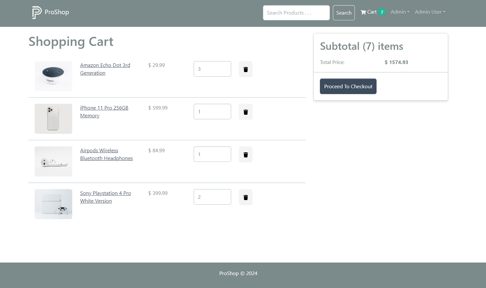

# ProShop - E-commerce Platform with MERN stack and Redux ToolKit

## E-commerce store with user and admin capabilities with the use of MERN stack and Redux

- The project objective is to create an E-commerce site with user and admin capabilities.

### Deployment link: 

- https://proshop-e-com-platform-your-ultimate.onrender.com/


### Project features:
```
- Full-featured shopping cart with quantity
- Product reviews and ratings
- Top products carousel
- Product pagination
- Product search feature
- Automatic search rendering
- User profile with orders
- Admin product management
- Admin user management
- Admin Order details page
- Mark orders as a delivered option
- Checkout process (shipping, payment method, etc)
- PayPal / credit card integration
- Custom database seeder script
```

  <table>
  <tr>
    <td align="center">
      
    </td>
    <td align="center">
      
    </td>
  </tr>
  <tr>
    <td align="center">
      
    </td>
    <td align="center">
      
    </td>
  </tr>
</table>

### Env Variables

Rename the `.env.example` file to `.env` and add the following

```
PORT=5000
MONGO_URI=<your_mongo_db_uri>
JWT_SECRET=<your_secret>
PAYPAL_CLIENT_ID=<your_paypal_client_id>
PAYPAL_APP_SECRET=<your_paypal_secret>
PAYPAL_API_URL=https://api-m.sandbox.paypal.com
PAGINATION_LIMIT=4
CAROUSEL_LIMIT=4
```
